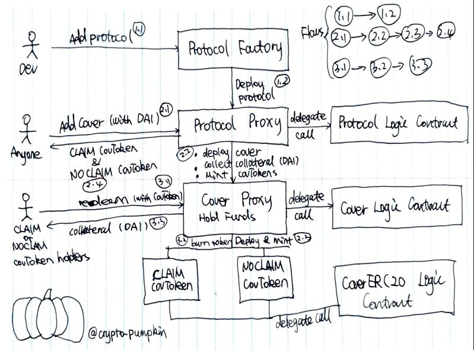
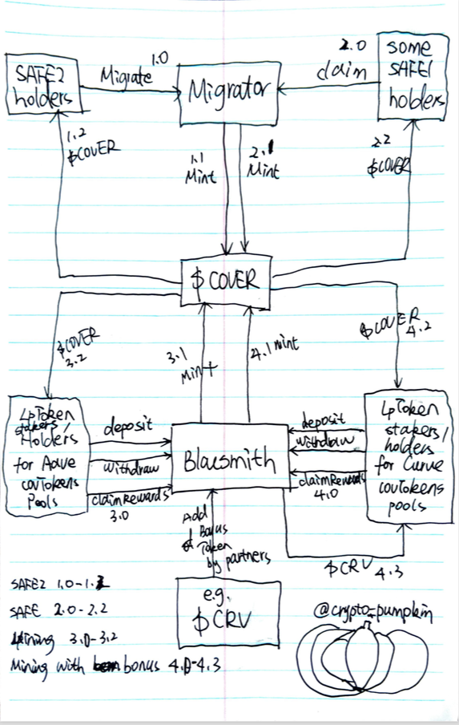

# Overview

Cover Core, COVER token, Cover shield mining, Cover backend, and Cover UI and more composed Cover Protocol. 

All deployed Solidity code are [_**public Github repos**_](https://github.com/CoverProtocol)_**.**_ 

## Cover Core 

### Design

### Audit

#### PeckShield



## Cover Token & Mining 

### Design

### Audit

#### The Arcadia Group

Final report is coming! 

