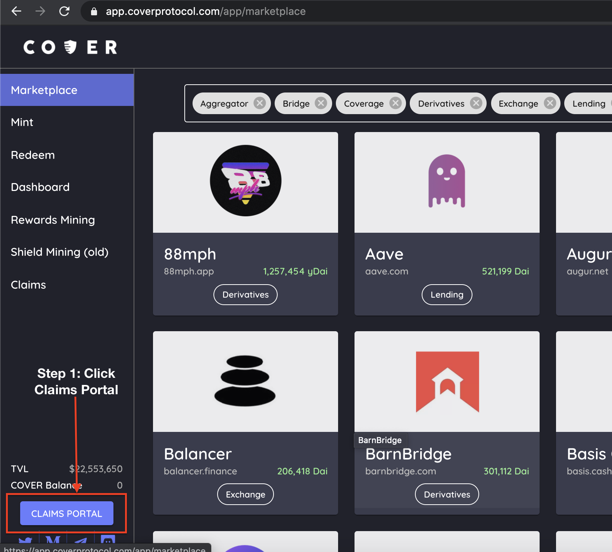
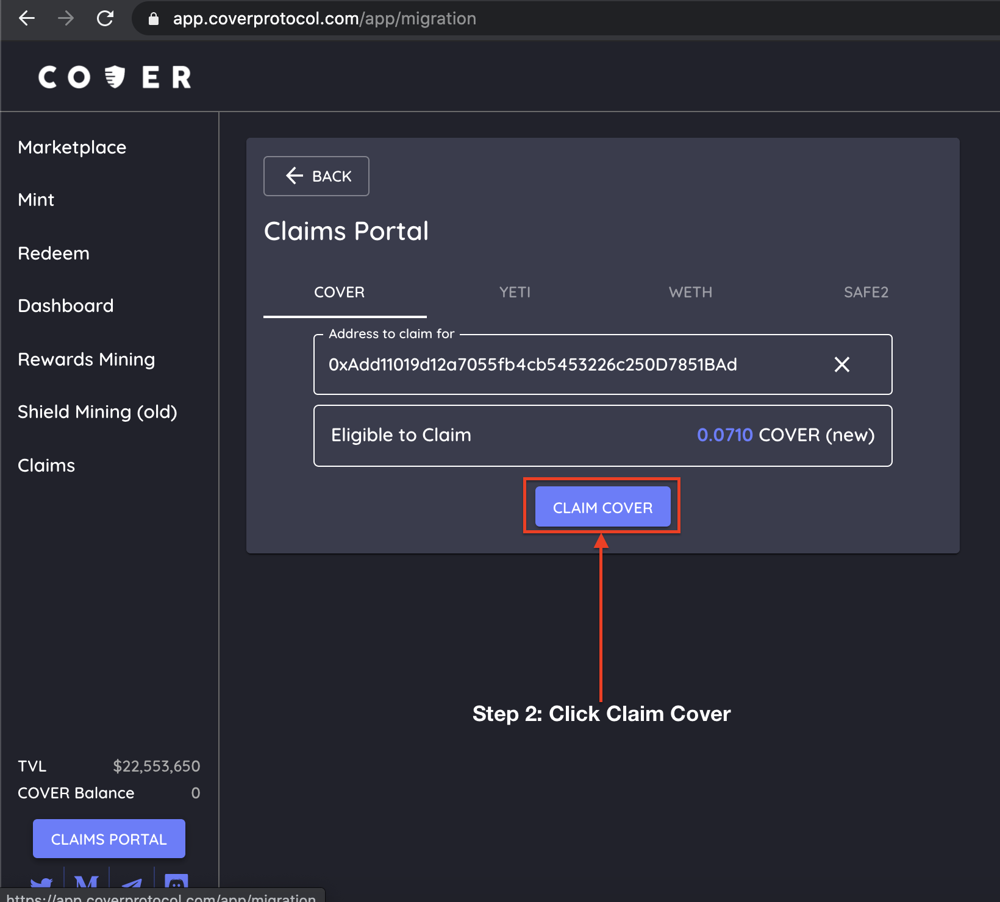
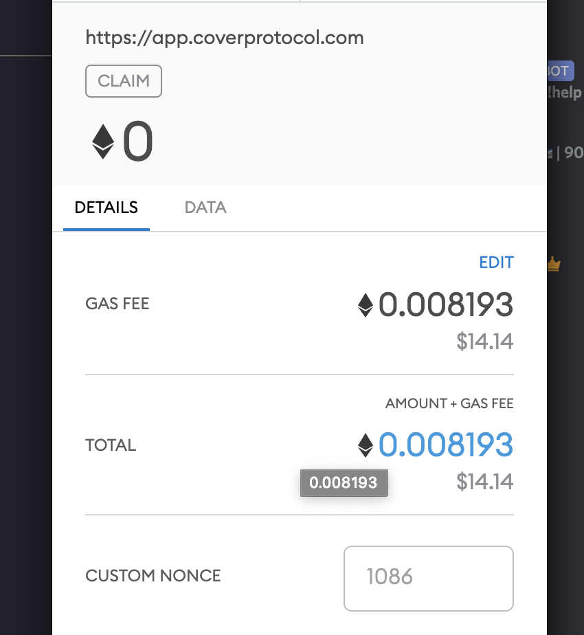

# Claim \(new\) Cover

Please refer to this [medium article](https://coverprotocol.medium.com/compensation-plan-b089d499191e) to see if you are eligible for the \(new\) COVER governance token. 

Reference: [https://coverprotocol.medium.com/compensation-plan-b089d499191e](https://coverprotocol.medium.com/compensation-plan-b089d499191e)

### Steps to Claim 

**Step 1:** Goto the [claim portal](https://app.coverprotocol.com/app/migration).

**Step 2:** Put in your address that held \(old\) COVER and press Claim Cover \(steps will be the same for YETI, wETH and SAFE2 tabs\). 


If you still hold the original SAFE token it will be shown under the "COVER" tab. 


**Step 3:** Confirm the Claim Cover transaction in metamask.


If you do not see the \(new\) COVER token in your metamask after completing the claim process, add the token address as a custom token.  
  
\(new\) COVER token address: 0x4688a8b1f292fdab17e9a90c8bc379dc1dbd8713


