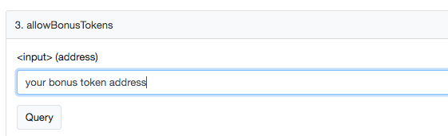
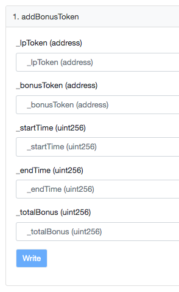

# Sponsor a Reward Program

You can sponsor any covToken DEX pool with a bonus token. By sponsoring a reward program, you encourage market makers to provide liquidity for coverages of your protocol. Once the Blacksmith contract is set up to use the bonus tokens for your protocols shield mining program \(Blacksmith contract\), the bonus tokens will be distributed to LPs of the trading pools linearly until expiration.

### First, contact the Cover Team to add the bonus token to the allow-list.

You can verify if your token is allowed on [_**etherscan**_](https://etherscan.io/address/0xE0B94a7BB45dD905c79bB1992C9879f40F1CAeD5#code). Status **1** means active.

### Second, verify the BPTs for both CLAIM and NOCLAIM tokens are in the Blacksmith __contract

If the coverage is set up in the [_**Blacksmith**_](https://etherscan.io/address/0xe0b94a7bb45dd905c79bb1992c9879f40f1caed5#writeContract) _****_contract, you should see the two pools showing up under the _****_[_**"Inactive"**_ ](https://app.coverprotocol.com/app/shieldmining) _****_tab of the shield mining page. If not, contact the Cover Team to add them to the [_**Blacksmith**_](https://etherscan.io/address/0xe0b94a7bb45dd905c79bb1992c9879f40f1caed5#writeContract) ****contract.

### Now you can call addBonusToken on [_Blacksmith_](https://etherscan.io/address/0xe0b94a7bb45dd905c79bb1992c9879f40f1caed5#writeContract) contract \([etherscan](https://etherscan.io/address/0xe0b94a7bb45dd905c79bb1992c9879f40f1caed5#writeContract), [github](https://github.com/CoverProtocol/cover-token-mining/blob/main/contracts/interfaces/IBlacksmith.sol#L48)\) to activate the program.

**Note:** first you will need to approve the [_**Blacksmith**_](https://etherscan.io/address/0xe0b94a7bb45dd905c79bb1992c9879f40f1caed5#writeContract) contract to spend the bonus token you want to incentivize shield mining with by calling `approve` on your shield mining reward token to the Blacksmith contract.

After you have approved the [_**Blacksmith**_](https://etherscan.io/address/0xe0b94a7bb45dd905c79bb1992c9879f40f1caed5#writeContract) contract to spend your tokens, call the `addBonusToken` function with the proper information.  
You will need to call the function twice if you want to sponsor both CLAIM and NOCLAIM trading pools. Calculate exactly how much bonus tokens you prefer to sponsor the CLAIM trading pool \(suggest 20%\) and NOCLAIM trading pool \(suggest 80%\).

The function call takes in:

* `_lpToken` is the CLAIM or NOCLAIM balancer pool address.
* `_bonusToken` is the address of the bonus token you would like to reward to shield miners. You will need to have the amount you want to sponsor approved by and in the account that calls this function.
* `_startTime` the epoch time \(in seconds\) you want to start the program. Please set it in the future with enough buffer for announcements, etc.
* `_endTime` the end of the program, usually a week \(or 10080 seconds\) before the coverage expiration. 
* `_totalBonus` the total amount \(in proper decimals\) of bonus tokens will be given out during the time period. This amount will be transferred into the Blacksmith contract when you call this function.

You are all done! LPs for the CLAIM/NOCLAIM trading pools will start to receive your bonus tokens when the program starts. 

Please note, you cannot add more rewards to a running program. You cannot start another program for the same pool till 7 days after the previous one ended. Please contact the Cover Team with any questions.

