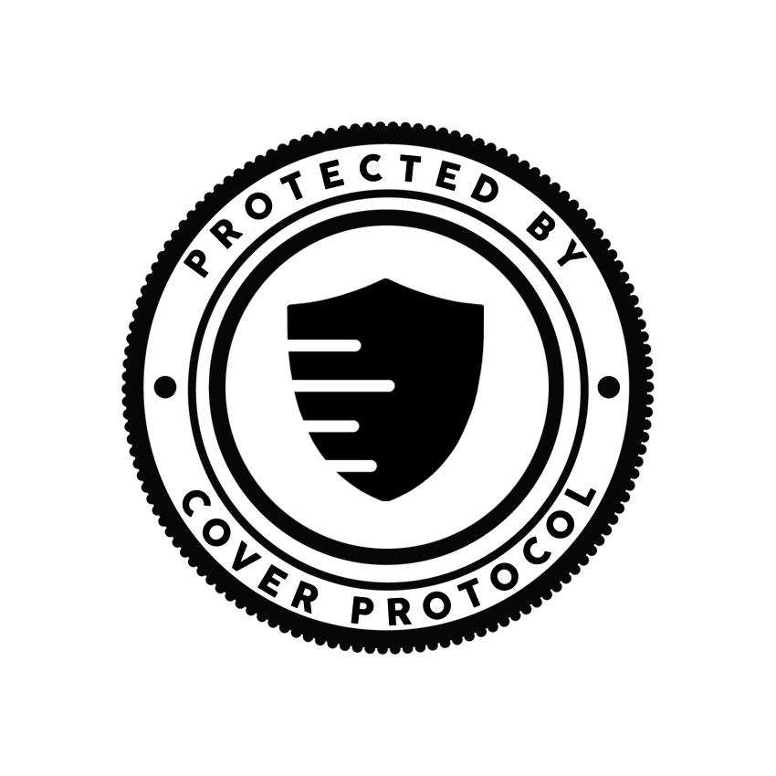

# Adding a Protocol

### Fill Out Form

#### [Protocol Proposal Form](https://forms.gle/btvrYEVLW4wNbfxJ)

If you are a protocol team member, fill out the [Protocol Proposal Form](https://forms.gle/btvrYEVLW4wNbfxJ).

[https://forms.gle/btvrYEVLW4wNbfxJ9](https://forms.gle/btvrYEVLW4wNbfxJ9)

#### Community Protocol Request Form

If you are a community member, fill out the Protocol Community Request Form.

[https://forms.gle/uZeafWNdLUqWBxUY6](https://forms.gle/uZeafWNdLUqWBxUY6)

### Contact the Cover Team

Once you ****have submitted the form, reach out to the team through contact@coverprotocol.com with preferred contact information.

Once you passed screening, we will proceed to add your protocol.

We charge a fee of **2 ETH** to cover deployment costs. Please send it to our dev multi-sig: **0x15957f0CA310d35b2E73fB5070Ce44A5B0141AB1**.

Once the fee is received, the Cover Team will handle contract deployments. We will mint the first coverage for you protocol, deploy the cover vault, two covTokens, and create DEX Pools for each covToken.

### Mint Coverage & Add Liquidity to Pools

Go to [_**Cover App**_](https://app.coverprotocol.com/app/mint) and mint CLAIM and NOCLAIM covTokens for your protocol. The first coverage will deploy 3 contracts. The Cover contract \(which holds the collateral\), the CLAIM token contract and the NOCLAIM token contract.  
Make sure you have enough DAI left to add liquidity to the DEX pools.

Once mint, add liquidity to the DEX Pools for covTokens.

### **Add "Protected by Cover Protocol" Stamp** 

Add the  ****[**"Protected by Cover Protocol"** stamp](https://docs.coverprotocol.com/website-links/logos) on your site and link it to [the app ](https://app.coverprotocol.com/app/marketplace)where users can buy coverage on your protocol.

