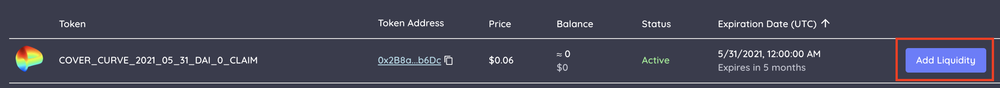
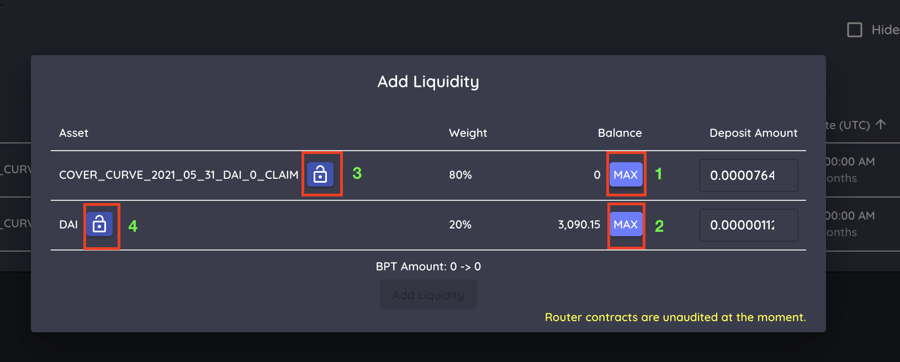
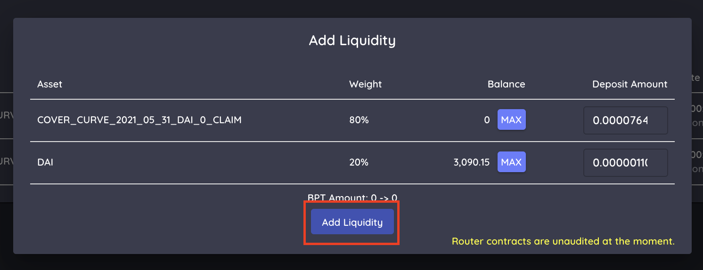
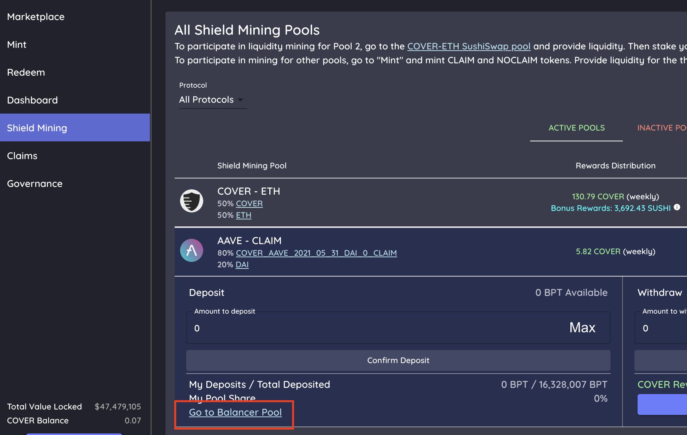
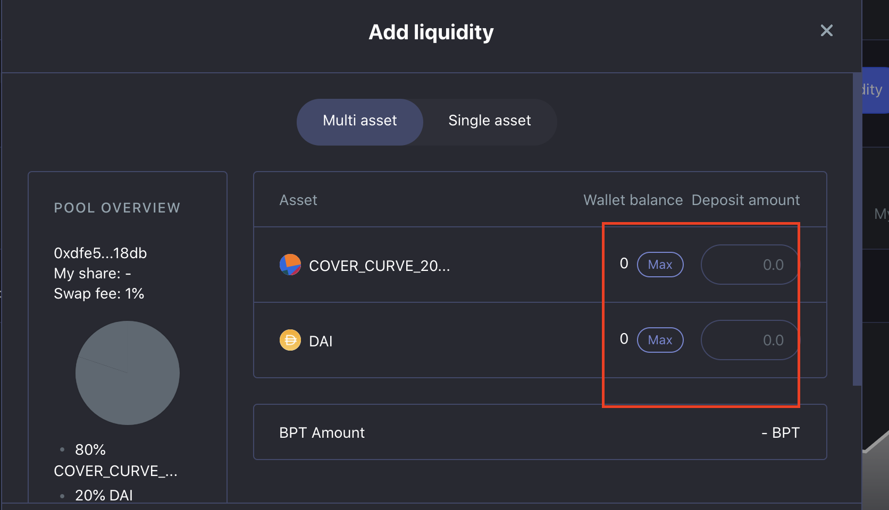
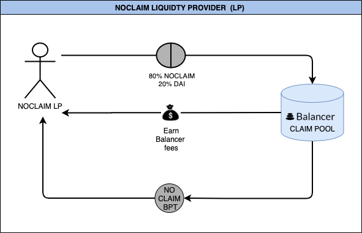

# CLAIM Liquidity Provider \(LP\)

## Simple Method

1. Go to "Dashboard"
2. Click "My Covers" tab
3. Click "Add Liquidity"
4. Click max on one of the two options, it will automatically weight it properly at 80% CLAIM and 20% DAI. \(step 1 OR 2\)
5. Unlock if necessary \(steps 3 & 4\)
6. Press add liquidity
7. Receive CLAIM Balancer Pool Token

## Complicated Method

1. Go to the shield mining tab and "Go to balancer pool"
2.  Press Add Liquidity.
3. Provide your CLAIM token and extra DAI as liquidity \(Balancer also supports single asset deposits\). Note this will be 80% CLAIM and 20% DAI.
4. Press Add Liquidity again.
5. Receive CLAIM Balancer Pool Token.
6. To remove Liquidity you would press remove liquidity on the same page\*

###                          Flowchart - CLAIM Liquidity Provider \(CLAIM LP\)

