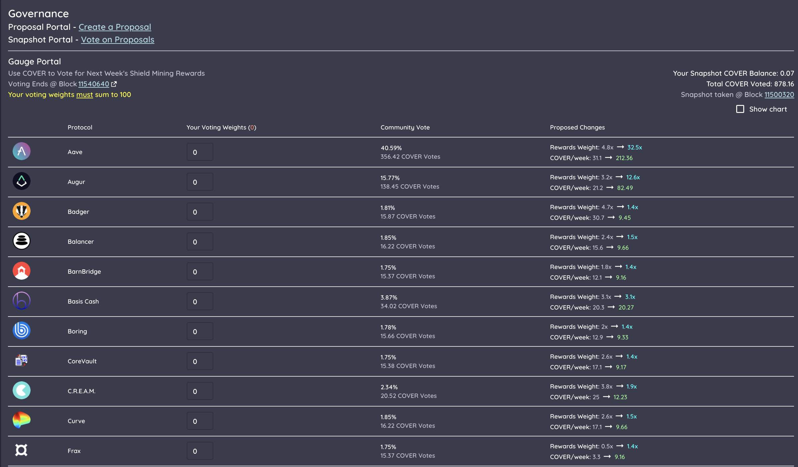
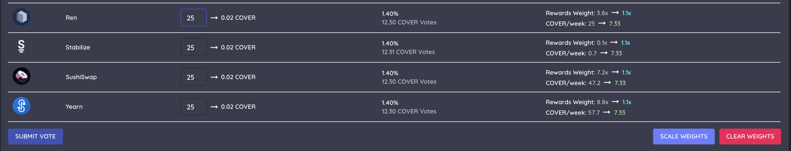

# Shield Mining Weights

You can vote on the $COVER shield mining rewards for every week.

* **Voting Start** — a target block \(shown on UI\) will be chosen in advance, which will dictate the start of the current voting session.
* **Voting End** — voting for the indicated period will end 40,320 blocks \(~7 days\) after the start block, at this point a new voting session will begin.
* **Voting Power** — A snapshot of your $COVER balance and staked $SLP \(in the shield mining contact\) will be taken at the start block. It will be used as your voting power. You can adjust your vote **unlimited times** before the deadline.
* Your voting power allocation **must equal 100** across all protocols you vote for. 

