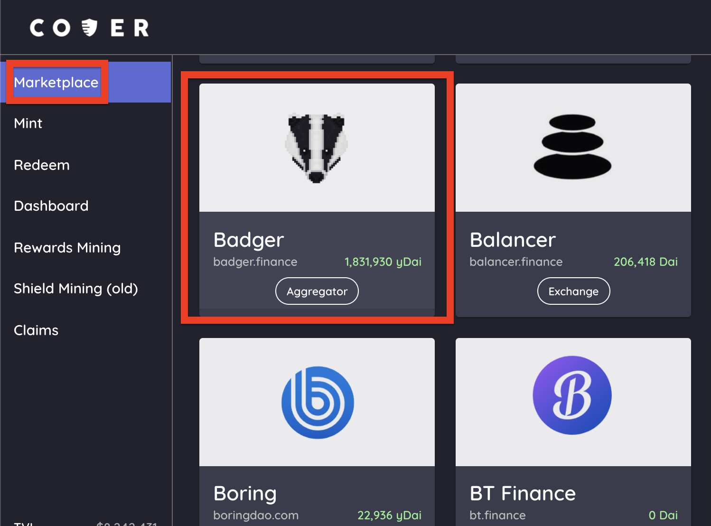
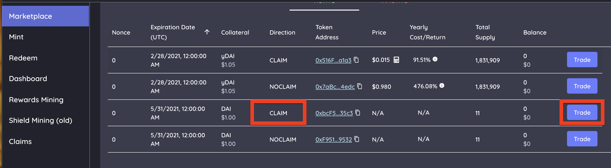
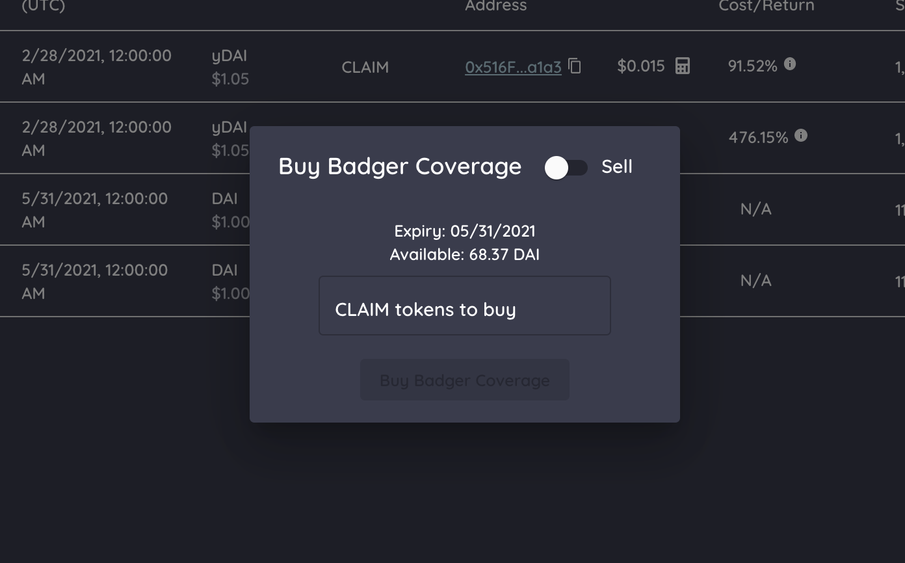

# Coverage Seeker

### What is a coverage seeker ?

A coverage seeker is a participant who wants to have coverage. Being a coverage seeker you are protecting your deposited funds that can be subject to a loss in a protocol. 

### How to buy coverage?

1. Click the protocol you want coverage on.
2. Choose the CLAIM token \(coverage\) for the status you prefer. There is always only one active CLAIM token for each expiration date. Click the BUY button on the specific expiration date, direction and nonce \(status\).
3. After clicking the "Trade" button it will pup up a modal for you to input amount of coverage to buy. Follow the UI. Once complete, you will receive the CLAIM token for the protocol. The transaction will always show up on etherscan.
4. Go to the [dashboard](https://app.coverprotocol.com/app/dashboard) tab and under “My Cover” it will list all the cover tokens you own. Verify you received the correct coverage token by checking that it has the correct expiration date, nonce, direction and active status.
5. For the CLAIM token to show up in your metamask wallet, add the specific CLAIM token address \(available on my cover page\) as a custom token.


Coverage seekers just buy the CLAIM token. That's it!


