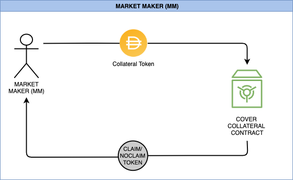

# Market Maker

### What is a market maker?

A market maker provides liquidity in both CLAIM and NOCLAIM tokens in order $$a = b$$ to ensure the coverage tokens are liquid and accessible for the market. Market makers provide an important service as without them, the coverage tokens would be very illiquid which makes it difficult for people to purchase coverage and stay protected.

### Why should I be a market maker?   

On top of being able to shield mine, market makers earn trading fees on both of the CLAIM/NOCLAIM pools which grows the value of their share of the pool. Usually pools may have a 2%-3% trading fee, which goes directly to the LPs. So for example, if a pool has $100,000 in volume, and 2% trading fees, that means the liquidity providers would earn $2,000!

### How to be a market maker 

1. Go to [https://app.coverprotocol.com](http://app.coverprotocol.com/) and click the drop down menu and choose the protocol you want to be a market maker on.
2. Select your preferred expiration date.
3. Enter the amount of funds \(collateral\) you want to provide. There will be an “Approve” button to approve your tokens. Click it. Let it confirm. 
4. After your tokens have been approved, a "mint" button will show up. Enter the amount of coverage you wish to mint.
5. After receiving both CLAIM and NOCLAIM tokens. They will be available from the [Dashboard](https://app.coverprotocol.com/app/dashboard) in the sidebar under the “My Cover” tab. If you do not see them, refresh. Verify you received the correct coverage token by checking that it has the correct expiration date, nonce, direction and active status.
6. For the CLAIM and NOCLAIM tokens to show up in your metamask wallet, add the specific token addresses \(available on my cover page\) as a custom token.

###                             Flow Chart Market Maker \(MM\)   

