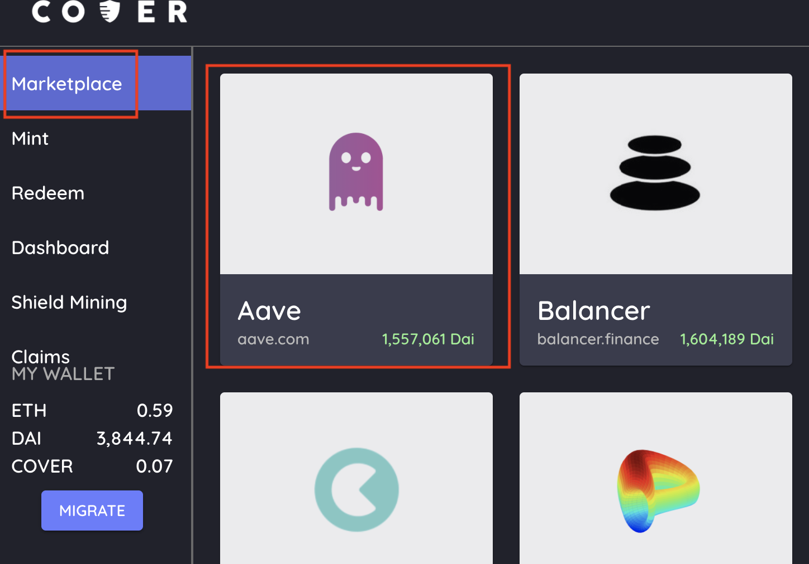
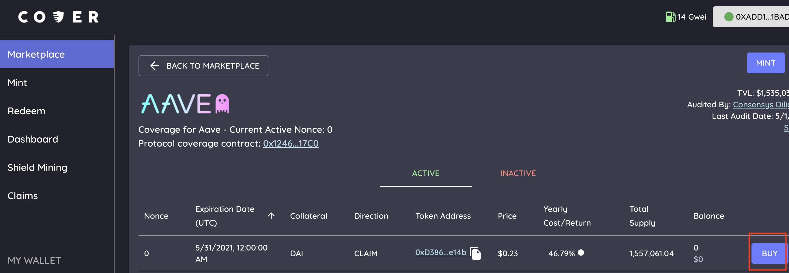
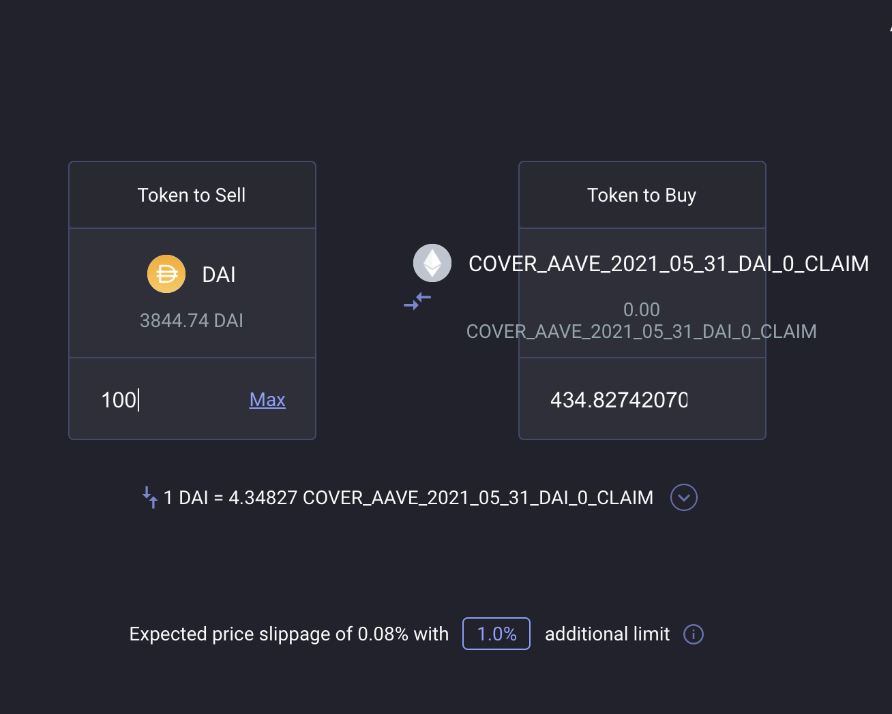

# Coverage Seeker

### What is a coverage seeker ?

A coverage seeker is a participant who wants to have coverage. Being a coverage seeker you are protecting your deposited funds that can be subject to a loss in a protocol. 

### How to buy coverage?

1. Click the protocol you want coverage on.
2. Choose the CLAIM token for the status you prefer. There is always only one active CLAIM token for each expiration date. Click the BUY button on the specific expiration date, direction and nonce \(status\).
3. After clicking the buy button it will have re-directed you to [Balancer Swap](https://balancer.exchange/#/swap). This is where you will swap DAI for the specific Coverage Token you want. Each CLAIM token is eligible **up to** 1 DAI in the event of an accepted claim. Buy as many as you need. Click Swap **\(For example: if you want to cover $100, purchase $100 claim token\).**
4. Once you have swapped you will receive the CLAIM token for the protocol. The transaction will always show up on etherscan.
5. Go to the [dashboard](https://app.coverprotocol.com/app/dashboard) tab and under “My Cover” it will list all the cover tokens you own. Verify you received the correct coverage token by checking that it has the correct expiration date, nonce, direction and active status.
6. For the CLAIM token to show up in your metamask wallet, add the specific CLAIM token address \(available on my cover page\) as a custom token.

###                                         Flowchart - Coverage Seeker \(CS\)

