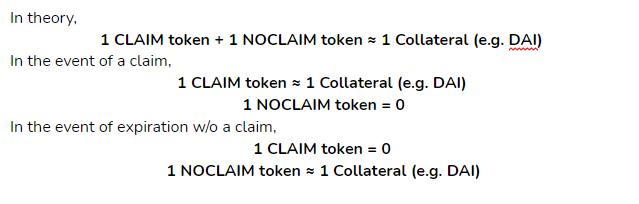

# Product Paper

## **Introduction**

Coverage for smart contracts has never been more important than now with the explosion of yield farming. However, current providers have limited capacity and/or unaffordable prices leaving most participants uncovered.

Cover Protocol provides peer to peer coverage with fungible tokens. It lets the market set coverage prices as opposed to a bonding curve.

The process starts when market makers \(MMs\) deposit collateral to cover a product. MMs will receive two types of fungible cover tokens in exchange for their deposit. MMs can choose to sell the fungible token\(s\) to earn a premium, or provide liquidity in Balancer pools with the fungible token\(s\) and earn fees. Coverage seekers can then buy the coverage they need.

Cover Protocol allows DeFi users to be protected against smart contract risk. It stabilizes the turbulent DeFi space by instilling confidence and trust between protocols and their users. By bridging the gap between decentralized finance and traditional finance, Cover Protocol will open the doors of DeFi to all investors.

**The long term vision for Cover Protocol is to allow anyone to buy coverage on anything.**

## **Fungible Cover Tokens**

At the core of Cover Protocol are the fungible cover tokens. Fungible cover tokens are created when a user deposits collateral into a Cover smart contract. Each Cover contract specifies the protocol to be covered \(ie Curve\), the preferred collateral \(ie DAI\), the amount to deposit, and then the expiration date of coverage. 

The fungible cover tokens are maintained on a 1:1 basis with their collateral. For each DAI deposited, the user receives 2 tokens, a CLAIM token and a NOCLAIM token. The NOCLAIM token represents rights to receive the deposited collateral in the event that a claim payout is NOT awarded during the designated coverage period. The CLAIM token represents a right to receive the deposited collateral \(or a fraction thereof\) in the event that a claim payout is awarded by the claims management process. Please see the section on “Claims Management” for more details.  
****

### **Ticker Symbols**

The format for tickers symbols for the CLAIM and NOCLAIM tokens is:

COVER\_{Protocol}\_{Expiration Date}\_{Collateral Currency}\_{Nonce}\_{Direction}

_**Example tokens for a coverage on Curve \(has no accepted claim\) that expires 12/31/2020:**_

**Symbol for CLAIM token**

_COVER\_CURVE\_2020\_12\_31\_DAI\_0\_CLAIM_

**Symbol for NOCLAIM token**

_COVER\_CURVE\_2020\_12\_31\_DAI\_0\_NOCLAIM_  

## **How It Works** 

The dual fungible cover token model gives maximum flexibility in terms of risk management by fully taking advantage of existing DeFi infrastructure. 

Once CLAIM and NOCLAIM tokens are minted, they can be placed into a Balancer pool, offered for sale on bounce, or even used as collateral in various lending platforms \(very risky but technically feasible!\). In order to facilitate these markets, whenever a new cover has tokens minted by Cover Protocol for the first time, Cover Protocol will create a Balancer pool with 80% CLAIM tokens and 20% DAI and another pool with 98% NOCLAIM and 2% DAI. In addition, the COVER UI will offer a convenient interface for locating all of the relevant Balancer pools for each cover. If there is demand, the same process can be replicated for Uniswap, Sushi, etc.

There are three types of participants in the Cover Protocol market: Market Makers, Coverage Providers, and Coverage Seekers. 

### **Market Maker \(MM\)**

Market makers hold both CLAIM and NOCLAIM tokens and provide liquidity for both fungible tokens.

**How to become a MM**

1. Deposit collateral 
2. Receive both CLAIM and NOCLAIM tokens
3. Provide liquidity for both CLAIM and NOCLAIM tokens

**Benefits**

* Earns liquidity provider fees by providing liquidity for both CLAIM and/or NOCLAIM tokens
* Participates in reward mining \(if applicable\) by staking the above LP tokens with Cover protocol
* Sells either side of the token at will
* Redeems collateral using both CLAIM and NOCLAIM tokens

**Risks**

* **Impermanent loss from providing liquidity, although the loss is minimal in the default 80/20 CLAIM/Collateral and 98/2 NOCLAIM/Collateral pools.** 

**The above charts show the scenario when there is a claim accepted on the protected product. Therefore, at the moment of a claim accepted, the CLAIM token goes to $1, the NOCLAIM token goes to $0.** 

### **Coverage Provider \(CP\)**

Coverage providers hold and provide liquidity for only NOCLAIM tokens.

We encourage project teams themselves to become Coverage Providers to show confidence in their projects and provide protection for their users at an affordable price.  
****

**How to become a CP**

1. Deposit collateral
2. Receive both CLAIM and NOCLAIM tokens
3. Sell CLAIM tokens for a premium and provide liquidity for only NOCLAIM tokens

**Benefits**

* Shows confidence in the protected project
* Protects the project’s users by providing affordable coverage
* Earns a premium by selling CLAIM tokens
* Earns liquidity provider fees by providing liquidity to the NOCLAIM tokens pool
* Participates in  rewards mining \(if applicable\) by staking the above LP token with Cover Protocol
* Sells NOCLAIM tokens at will to eliminate risk
* Redeems collateral using NOCLAIM tokens when the cover expires and grace period is finished
* Redeems collateral with both CLAIM and NOCLAIM tokens by buying the same amount of CLAIM tokens before the cover expires or before there is an accepted claim

**Risks**

* Loses collateral when there is a claim accepted against the protected protocol \(in the event of user funds lost\)
* Impermanent loss from providing liquidity, although the loss is minimal in the default 98/2 NOCLAIM/Collateral pools

### **Coverage Seeker \(CS\)**

Coverage seekers hold and only CLAIM tokens. The goal is to cover the exposure to the protected product

**How to become a CS**

1. Buy and hold CLAIM tokens from the pool directly

    **Or**

1. Deposit collateral and receive both CLAIM and NOCLAIM tokens. 
2. Sell the NOCLAIM tokens and provide liquidity for only CLAIM tokens

**Benefits**

* Be protected against the underlying project
* Earns liquidity provider fees by providing liquidity for CLAIM tokens
* Redeems collateral payout using CLAIM tokens when there is an accepted claim after the grace period finishes
* Sells CLAIM tokens at will when coverage is no longer desired
* Redeems collateral with both CLAIM and NOCLAIM tokens by buying the same amount of NOCLAIM tokens before the cover expires or before there is an accepted claim

**Risks**

* Lose the paid premium when there is no claim. Remember, that means funds are safe in the protected project
* Impermanent loss from providing liquidity, although the loss is minimal in the default 80/20 CLAIM/Collateral pools

**Disclaimer: COVER Protocol will charge a fee \(0.1%\) from all actions where redeeming occurs.**

## **Claims Management**

The process follows the following steps. 

1. File a claim. The fees will be refunded to the filer if the claim is accepted.
   1. Anyone can file a claim against a protected product by paying the claim file fee. The filing fees for each protocol will be increased by a multiplier each time a claim is filed, preventing spam attacks.
   2. Anyone can file a FORCED claim against a project by paying the force claim file fee. Step 2 is skipped if a claim is FORCE filed.
2. Decide a claim by voting. Once a claim is filed, a snapshot voting page is created for the claim. COVER token holders can participate in voting whether it is a valid or invalid claim. If the voting rejects the claim, the claim is decided and rejected \(if anyone disagrees with the community voting result, file a FORCED claim is the option\). If the voting accepts the claim, the claim will be passed to the auditors in the next step.
3. Final Decision by the Claim Validity Committee. The Claim Validity Committee will review the filed claim and make a decision whether the claim meets the requirements to be accepted and what the payout % should be. Each claim will be assigned to 5 or more auditors. To decide a claim, more than 50% of the auditors must agree on the validity of the claim and payout percentage \(up to 100%\) if the claim is accepted. The claim that the auditors accept will have the claim fee refunded to the filer. Every other filed claim on the same protocol will be denied and the fees will be sent to the treasury.
4. Once a claim is accepted in the above step, the CLAIM token holders will be able to start to redeem their payout after a delay period.

### **Claim Validity Committee \(CVC\)**

Cover Protocol hopes to add a level of educated assessment to the decision making process for claims assessors to be fully informed before making a decision on the outcome. 

We propose a monetary, incentivized role to those that have established a brand within the smart contract auditing industry to better align the outcome of our assessments to all claimants. 

The role of a CVC member is extremely important. They provide information to Cover Protocol stakeholders, especially the providers and the seekers. Their knowledge helps all Cover stakeholders understand the risks at hand and the conditions behind coverage.  

