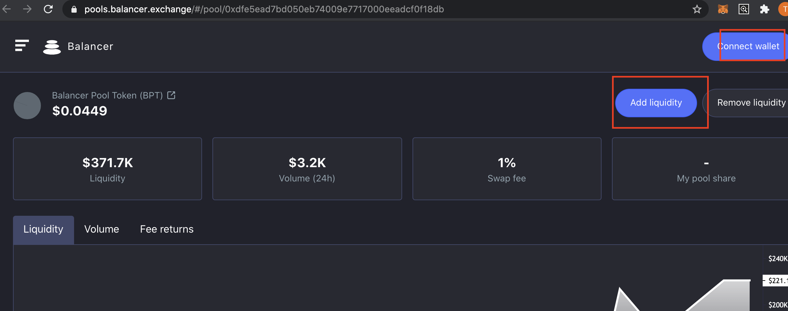

# NOCLAIM Liquidity Provider \(LP\)

1. Go to the shield mining tab and "Go to balancer pool"
2.  Press Add Liquidity.
3. Provide your NOCLAIM token and extra DAI as liquidity \(Balancer also supports single asset deposits\). Note this will be 50% CLAIM and 50% DAI.
4. Press Add Liquidity again.
5. Receive NOCLAIM Balancer Pool Token.
6. To remove Liquidity you would press remove liquidity on the same page\*

