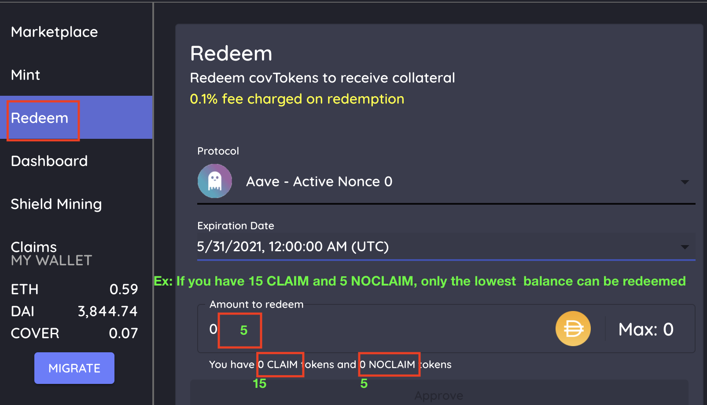
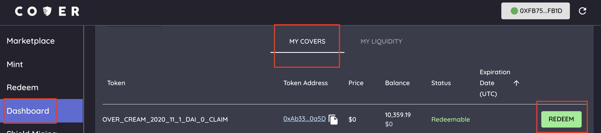

# Redemption

## **Redeem Funds with Active Tokens**

* Prior to expiry or an accepted claim, users can redeem back their collateral with both their CLAIM and NOCLAIM tokens.

1. Goto the [Redeem tab](https://app.coverprotocol.com/app/redeem).
2. Choose the protocol you want to redeem for.
3. Choose the expiration date.
4. Choose the amount of collateral or funds you want back. _`example: if you have 15 NOCLAIM and 5 CLAIM tokens, you will only be able to redeem 5 DAI)`_
5. Redeem.

Note: there is a claim accepted for the protocol token nonce which is the same as your tokens’, you will need to redeem CLAIM tokens from [Claims payout](https://app.coverprotocol.com/app/claim) and NOCLAIM tokens \(if payout is less than 100%\) in “Redeem”, under the [dashboard](https://app.coverprotocol.com/app/dashboard) tab under “My Cover”. There will be a **REDEEM** button.

## **Redeem Funds with Inactive Tokens or Accepted Claim Events**

* Upon expiry of the coverage, when there is no accepted claim, users can redeem their inactive NOCLAIM tokens for their collateral. There will be a default **3 day grace period** after expiry to make a claim on an incident that occured before the expiry of a specific coverage.
* **When no claim is accepted** there will be a default **10 day** delay for redemption of NOCLAIM tokens.
* **When a claim is accepted** there will be a default **2 day** delay for CLAIM tokens \(and NOCLAIM tokens if partial payout\).

1. Go to the [dashboard](https://app.coverprotocol.com/app/dashboard) tab under “My Cover”.
2. There will be a **REDEEM** button on which tokens you can redeem for your collateral.
3. This is for expired/inactive tokens and accepted claims

