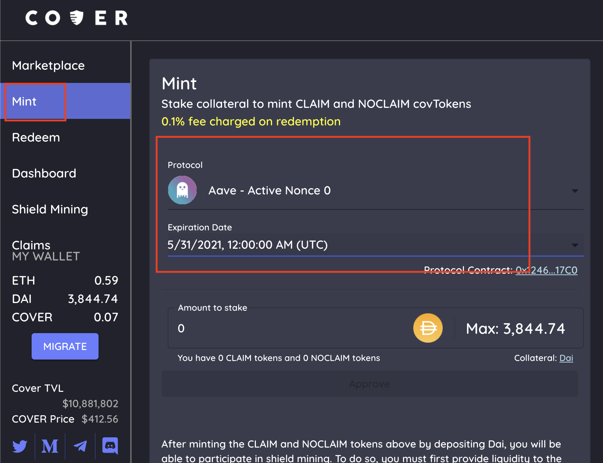
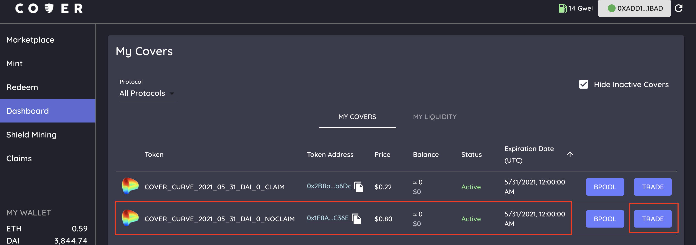
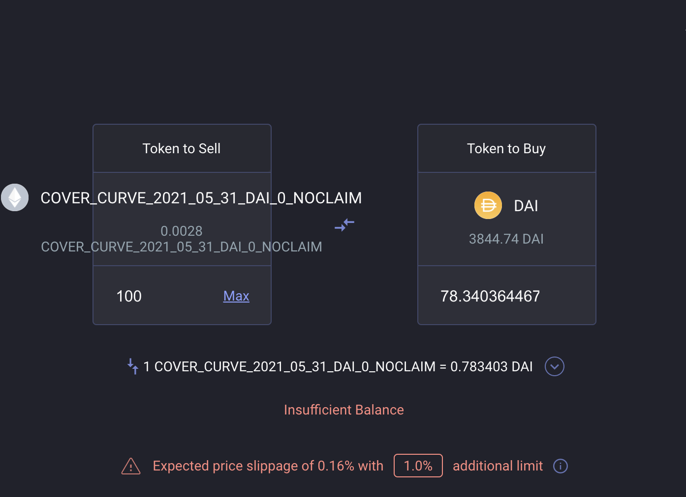
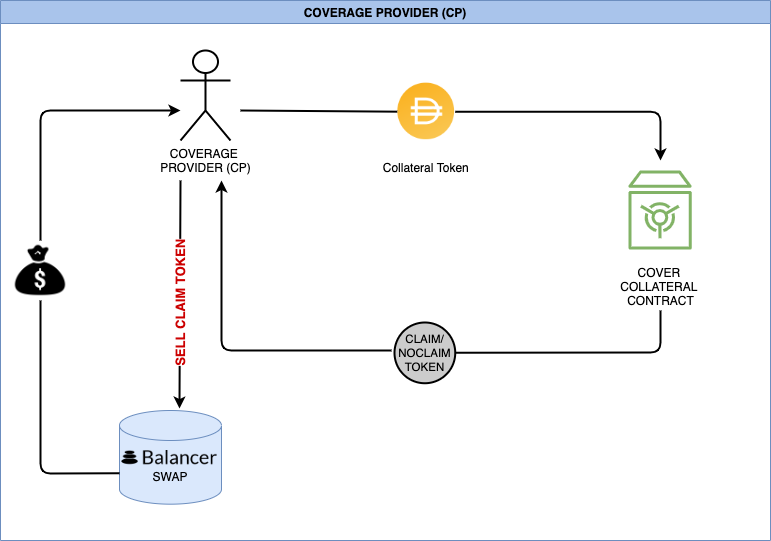

# Coverage Provider

### What is a coverage provider?

A coverage provider is a participant who deposits collateral to mint NOCLAIM/CLAIM and sells their CLAIM on the market. A coverage provider would do this if they are confident in the protocol, or is the protocol themselves seeking to make coverage cheaper for their users by lowering the price. However, do keep in mind that without holding CLAIM tokens, in the event of a claim payout you lose access to your original collateral entirely. However, most protocols can provide a decent reward for selling CLAIM on market, so it's an attractive reward if you are confident in the related protocol. 

### Why should I be a coverage provider?

As a coverage provider, you mint CLAIM/NOCLAIM and sell it on the market for a quick, upfront premium earned. If no incident occurs by expiration, you can redeem your NOCLAIM back for all of your initial collateral \(minus the redemption fee\) and keep the upfront premium. 

### How to provide coverage?

1. Deposit funds \(collateral\) by going to the [Mint tab](https://app.coverprotocol.com/app/mint) on the cover app.
2. Click the drop down menu and choose the protocol you want to be a market maker on.
3. Choose the expiration date.
4. Enter the amount of funds \(collateral\) you want to provide. There will be an “Approve” button. Click it. Let it confirm. A “Mint” button will show up. Enter the amount of coverage you wish to mint.
5. Receive both CLAIM and NOCLAIM tokens. They will be available in the [dashboard](https://app.coverprotocol.com/app/dashboard) tab under “My Cover”. If you do not see them, refresh. Verify you received the correct coverage token by checking that it has the correct expiration date, nonce, direction and active status.
6. Click the trade button in the [dashboard](https://app.coverprotocol.com/app/dashboard) tab under “My Cover”. This will redirect you to [Balancer Swap](https://balancer.exchange/#/swap). Verify you received the token that has the correct expiration date, nonce, direction and active status. **This is where you will sell the CLAIM token to DAI \(if liquidity allows it\). Enter the amount of CLAIM token you would like to sell. Click Swap.** 
7. For the CLAIM and NOCLAIM tokens to show up in your metamask wallet, add the specific addresses token address \(available on my cover page\) as a custom token.

###  

###                                     Flowchart - Coverage Provider \(CP\)

