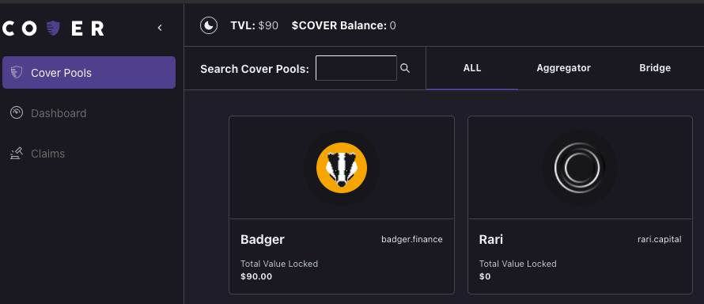
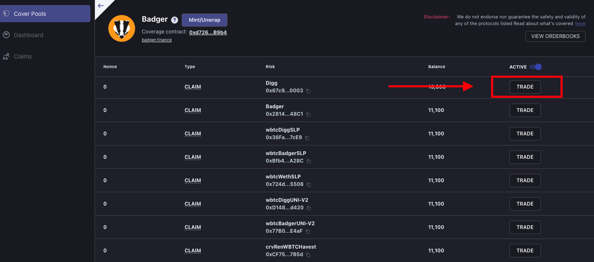
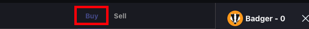
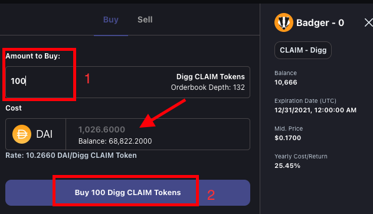
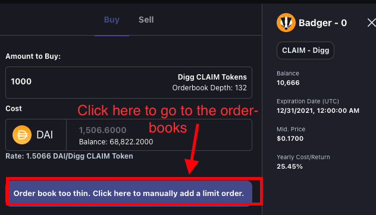

# Buying Coverage

## **Step 1: Go to your Cover Pools.** 

## Step **2**: Goto the Cover Pools tab and c**lick the protocol you would like coverage on**

## Step 3: Click the "Trade" button on the left hand side under the coverage you would like to purchase. 

## Step 3: Select the "Buy" tab on the module that pops up.

## Step 4: \(1\) Enter the amount of CLAIM tokens you want to buy, you will see the amount of DAI it will cost. \(2\) Then click Buy CLAIM tokens.


By doing the above steps, you are market buying the CLAIM tokens. You will get the best price available.  
  
If the order you put in can not be completed it will direct you to the order-books for you to place a buy order of your liking. See below. 


