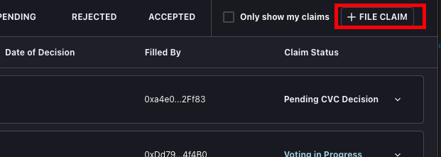

# Claims/Filing

## **Claim Management \(CM\)**

### Filing A Claim

1. File Claim via **\[FILE NEW CLAIM\]** under [Claims tab](https://app.coverprotocol.com/app/claim) .
2. Select the protocol to file a claim against.
3. Choose the Date and Time the incident occurred \(Must be within 3 day prior\).

   1. You have two options: a regular claim which is 50 DAI and multiplies each time a claim is submitted by any user. This will go to the community to vote on and if valid will move to the CVC \(Auditor\) for a final decision.
   2. Or a force filed claim which is 500 DAI and will be sent to CVC directly for a decision and bypass the community voting.
   3. For both of these you will need to approve the transaction, then submit the transaction \(2 separate tx\)
   4. Submit claim.

### Voting On A Claim

1. Go to the main [Claims tab](https://app.coverprotocol.com/app/claim) and vote on any open claims. Click VOTE.
2. This will bring you to a snapshot.page where you will vote if a claim should be passed to the CVC \(Auditor\) or not. \(Valid/Invalid\)
3. If the community quorum is met and states its valid, the claim moves on to the CVC \(Auditor\) for the final decision.
4. If the final decision of the community is invalid - it ends there.

_**\***_**There will be a default 3 day grace period after expiry to make a claim on an incident that occured before the expiry of a specific coverage.**

###                                        Flowchart - Claims Management \(CM\)

