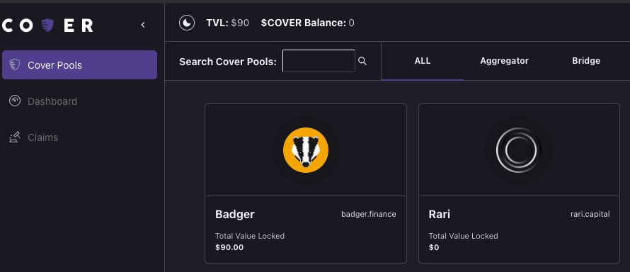

# Minting Coverage


If you would like to become a **coverage provider** or **market maker** you will need to **mint CLAIM and NOCLAIM tokens**.   
  
Each protocol you mint coverage for you will only receive **one NOCLAIM token** but **can receive multiple CLAIM tokens**.   
  
You will also receive a **FUTURE token** which can be **redeemable for any CLAIM token added for that specific protocol**


## Step 1: Goto the Cover Pools tab, c**lick the protocol you would like to mint CLAIM and NOCLAIM tokens for.** 

## Step 2: Click the mint button. 


Under each protocol coverage, you may have the option to mint multiple different types of coverage. Example: Badger has multiple different vaults. Using $1 you can mint covToken for multiple different vaults. This leverages that $1 across various risks. 


## Step 3: Select the expiration you would like to mint coverage for, the collateral type you would like to deposit and the amount of collateral.

## Step 4: Click the mint button to mint the CLAIM and NOCLAIM token\(s\) and confirm the transactions via metamask. 


There will be two transactions. Approve being the first and then a second transaction to complete the minting process.



Congratulations you have minted CLAIM and NOCLAIM tokens. You can check etherscan and see all the CLAIM tokens you have. 


_**Example: Here you have received 11 different CLAIM tokens for multiple Badger Vaults, 1 NOCLAIM token and 1 FUTURE token.**_  



