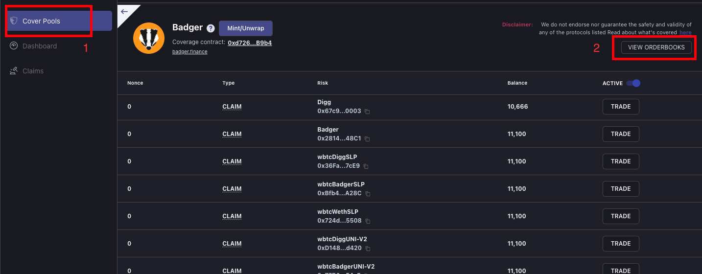

# Order-books: Advanced

### Cover Order Books

Order-books provide an attractive option to Coverage Providers as it enables them to place limit orders at a price they believe will compensate them properly for the risk of a claim.  Cover v2 will have a dedicated section with a custom UI for order-books powered by 0x. Placing an order will be gas-less, but cancelling and executing an order will require the trader to pay gas.

Order-books are also attractive for Cover Buyers as it enables them to place a order at a price they feel is fair to be covered at. 

## You can find the order-books here: [https://coverrules.com/](https://coverrules.com/)  OR 

### You can access the order-books under the Cover Pools Tab, click the protocol you want to access the order-book for and then click view order-books!

## 

