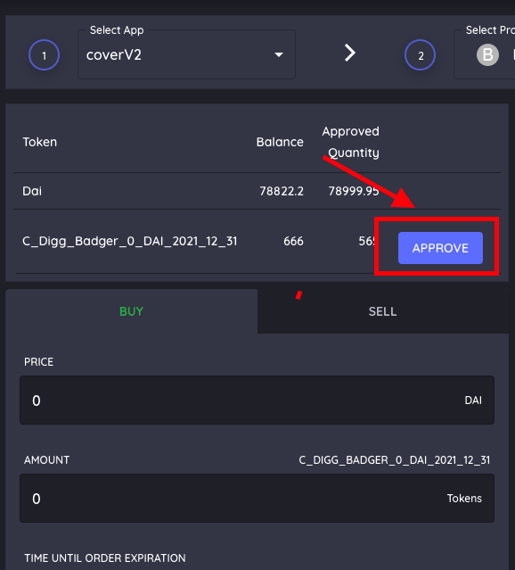
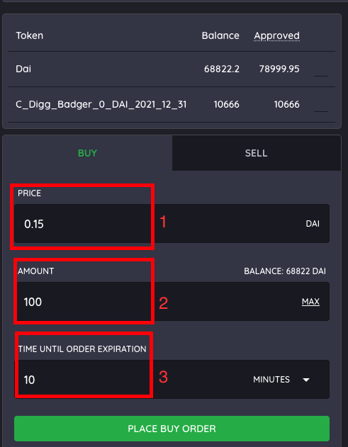
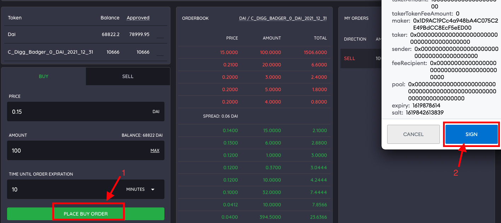

# Buying Coverage - Order Book

**The website to access the order books is located here:** [**https://coverrules.com/**](https://coverrules.com/)\*\*\*\*


Buying on the order book allows you to set the amount of coverage you would like to buy at the rate you want. Place the sell order and let it get filled. This can be done with CLAIM and NOCLAIM tokens. 



When buying on the order books, you are responsible for paying the gas to execute the order! 


##  Step 1: \(1\) Select the app. \(2\) Select the protocol. \(3\) Select the token you would like to buy. 

## Step 2: Approve the tokens. 

## Step 3: \(1\) Enter the amount DAI you are willing to pay per CLAIM token \(2\) Enter the amount of coverage you would like to buy. \(2\) Set the amount of time you would like the order to be good for. 

## Step 4: \(1\) Click "Place Buy Order". \(2\) Sign the transaction - this does not cost any money. You only pay money if the order goes through.

## You will see your order appear on the order book. Once the order is filled you will receive the CLAIM token which represents your amount of coverage. You can cancel your order at any time before its filled. 

