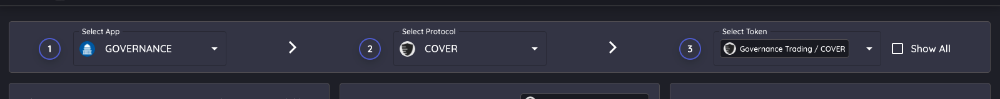
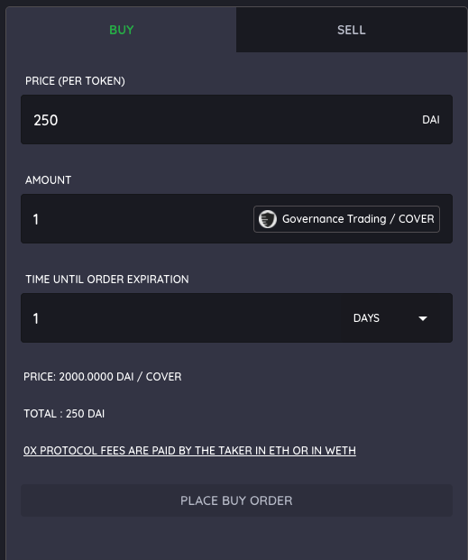
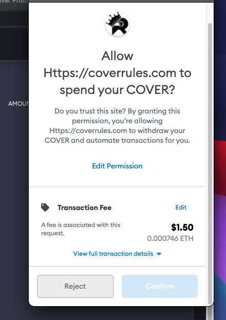
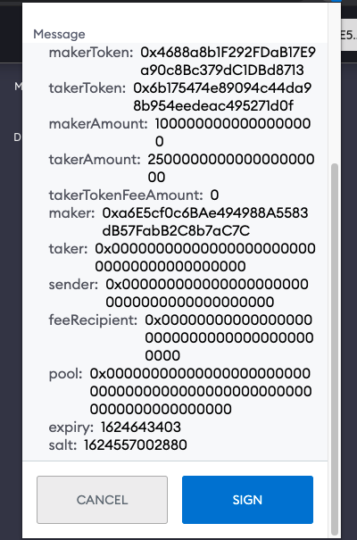

# Buying $COVER

**The website to access the order books is located here:**

[**https://coverrules.com/?application=governance&protocol=COVER**](https://coverrules.com/?application=governance&protocol=COVER)\*\*\*\*


Buying on the order book allows you to set the amount of tokens you would like to buy at the price you desire with no slippage. Place the buy order and let it get filled. 



When buying on the order books, you are responsible for paying the gas to execute the order! 


####  Step 1: \(1\) Select Governance. \(2\) Select the protocol. \(3\) Select the token you would like to sell. 

#### 

#### Step 2: \(1\) Enter the amount of DAI you are willing to pay per token \(2\) Enter the number of tokens you would like to buy. \(2\) Set the amount of time you would like the order to be good for. 

#### 

#### Step 3: \(1\) Click "Place Buy Order". \(2\) Confirm the transaction \(3\) Sign the transaction - this does not cost any money. You only pay money to cancel and if the order is executed.

#### You will see your order appear on the order book. Once the order is filled you will receive the token and no longer have the DAI. You can cancel your order at any time before its filled. 

