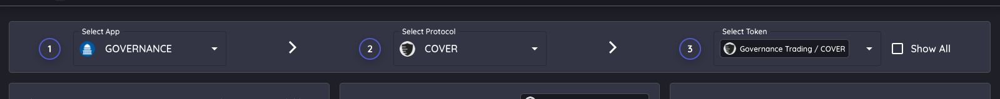
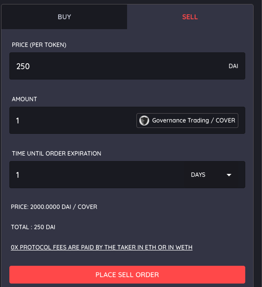
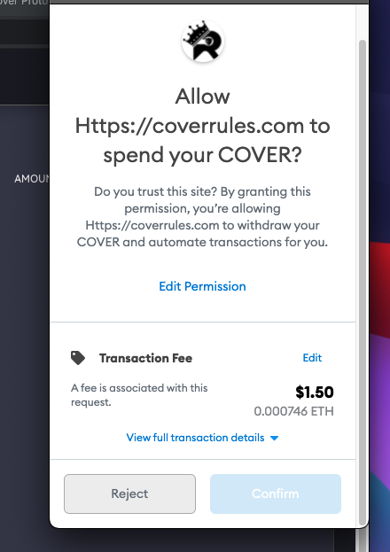
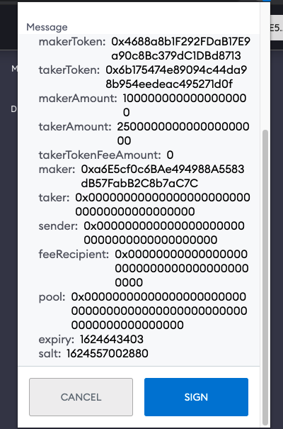

# Selling $COVER

**The website to access the order books is located here:**

[**https://coverrules.com/?application=governance&protocol=COVER**](https://coverrules.com/?application=governance&protocol=COVER)\*\*\*\*


Selling on the order book allows you to set the amount of tokens you would sell, at the price you want with no slippage. Place the sell order and let it get filled. 



When selling on the order books, the seller only pays gas if canceling an order! The buyer pays the gas for taking an order!


####  Step 1: \(1\) Select Governance. \(2\) Select the protocol. \(3\) Select the token you would like to sell. 

#### 

#### Step 2: \(1\) Enter the amount of DAI you would like to receive per token \(2\) Enter the number of tokens you would like to sell. \(2\) Set the amount of time you would like the order to be good for. 

#### 

#### Step 3: \(1\) Click "Place Sell Order". \(2\) Confirm the transaction \(3\) Sign the transaction - this does not cost any money. You only pay money to cancel the order.

#### You will see your order appear on the order book. Once the order is filled you will receive the DAI and no longer have the token. You can cancel your order at any time before its filled. 

