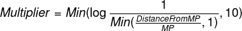

# Rewards

### **Order Book Rewards Info**

Rewards are distributed to people utilizing the order book system. In order to receive rewards you can place sell orders in the specified pairs. 

The difference between the price of your order and the market price, as well as the amount of your order, determines the amount of rewards you get. 

To get most rewards you need to place your larger sell orders closest to the market price. We will be doing a snapshots of the order books once an hour and distribute rewards once a week as well.

As you move further away from the market price the rewards diminish.


**Rewards Forumula:** 



```text
Multiplier = Min(\log \frac{1}{ Min(\frac{Distance From MP}{MP},1)},10 )
```

