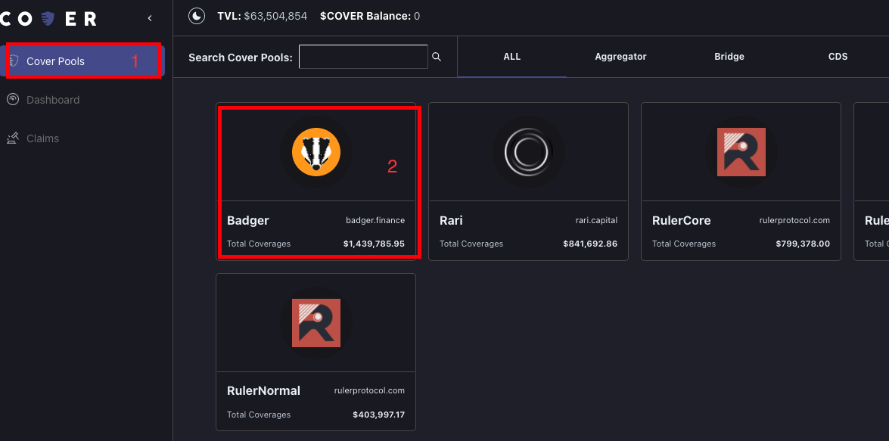

# Unwrap

### Unwrapping allows you to return CLAIM + NOCLAIM + FUTURE tokens. By doing this you can get your collateral back without waiting for the expiration redemption/selling. 

**Example:** 

* **You minted 100 CLAIM, 100 NOCLAIM and 100 FUTURE tokens for Badger coverage using 100 DAI.** 
  * **You must return those 100 CLAIM, 100 NOCLAIM, and 100 FUTURE**

     **tokens to get your 100 DAI back.**

    * **If you have 100 CLAIM, 99 NOCLAIM, and 100 FUTURE tokens you will only get 99 DAI back on the unwrap**
    * **If you have 99 CLAIM, 100 NOCLAIM, and 100 FUTURE tokens you will only get 99 DAI back on the unwrap**

## STEP 1: Go to the "Cover Pools" tab. Click the protocol you want to unwrap your covTokens for. 

## **STEP 2: Click the "Mint/Unwrap" button.** 

## STEP 3: Select Unwrap

## STEP 3: Choose the expiry, collateral type and amount of covTokens you want to return for your collateral. Click the "Unwrap" button. 

