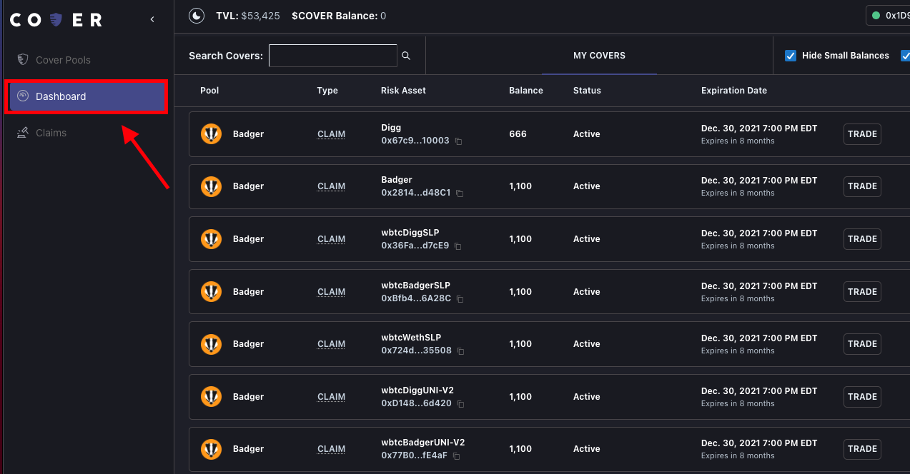
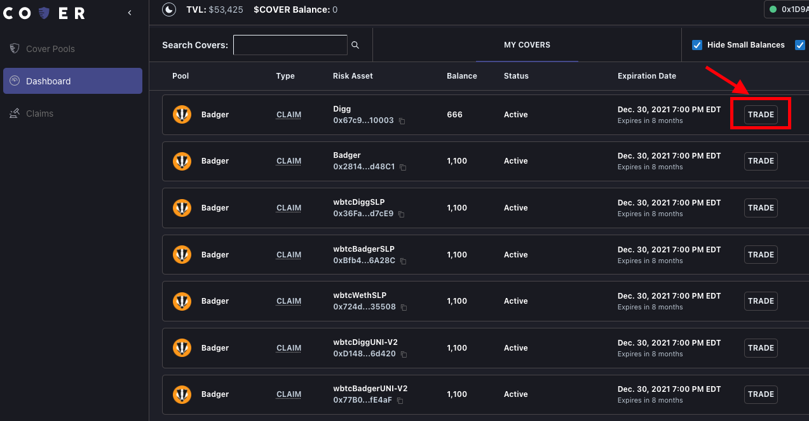
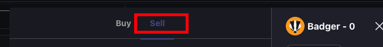
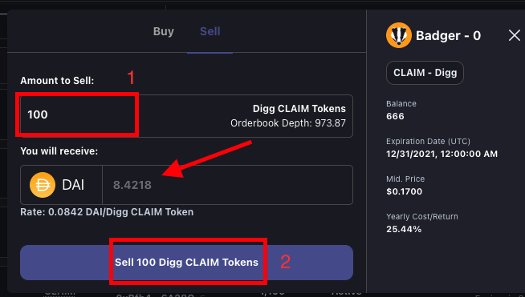
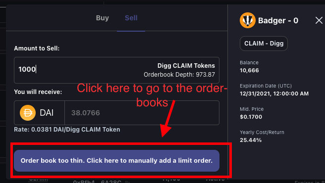

# Selling Coverage - Basic

## **Step 1: Go to your dashboard. This will show all the covTokens you own.** 

## Step 2: Click the "Trade" button on the left-hand side, under the CLAIM token \(coverage\) you would like to sell. 

## Step 3: Select the "Sell" tab on the module that pops up.

## Step 4: \(1\) Enter the number of CLAIM tokens you want to sell, you will see the amount of DAI you will receive. \(2\) Then click Sell CLAIM tokens.


By doing the above steps, you are market selling your CLAIM tokens. You will get the best price available.  
  
If the order you put in can not be completed it will direct you to the order-books for you to place a sell order of your liking. See below. 




