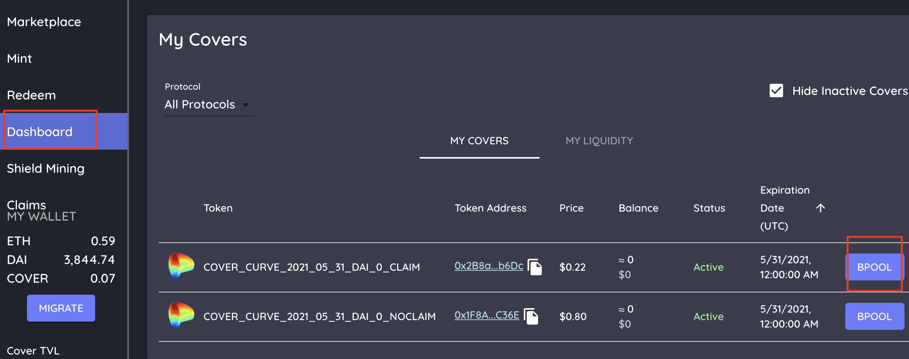
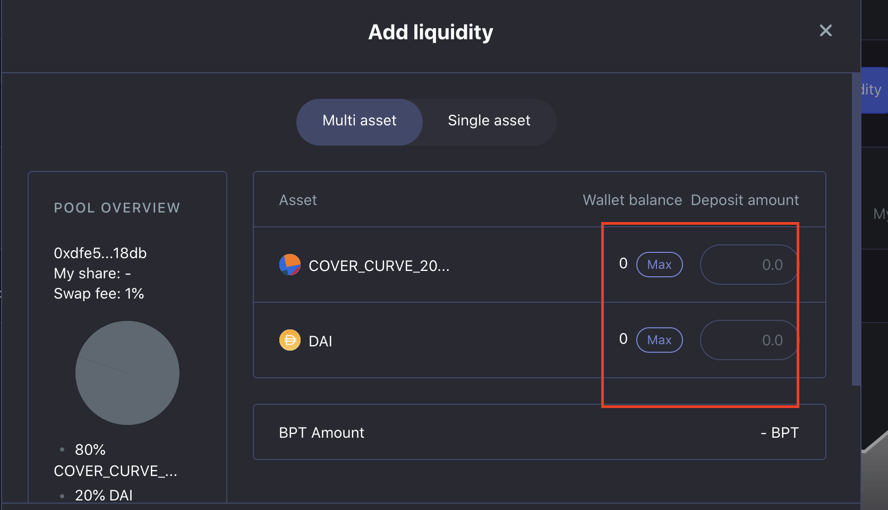
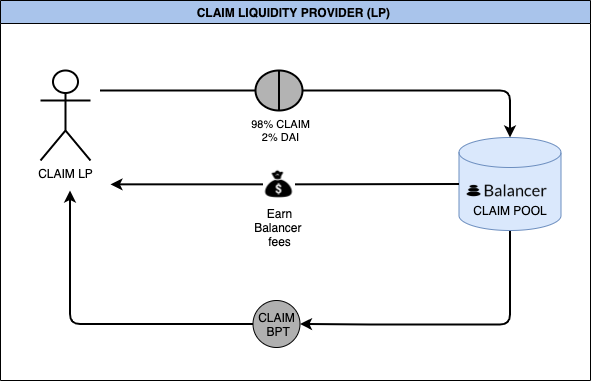

# CLAIM Liquidity Provider \(LP\)

1. “BPool” button under the [dashboard](https://app.coverprotocol.com/app/dashboard) tab under “My Cover”. This takes you to the correct pool.
2.  Press Add Liquidity.
3. Provide your CLAIM token and extra DAI as liquidity \(Balancer also supports single asset deposits\). Note this will be 80% CLAIM and 20% DAI.
4. Press Add Liquidity again.
5. Receive CLAIM Balancer Pool Token.
6. To remove Liquidity you would press remove liquidity on the same page\*

###                          Flowchart - CLAIM Liquidity Provider \(CLAIM LP\)

