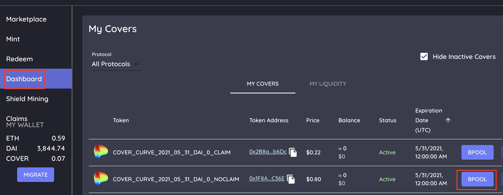
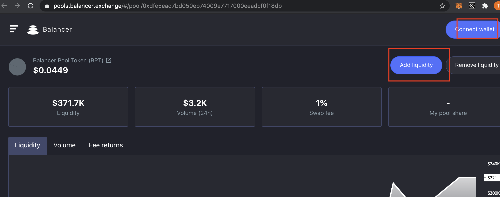
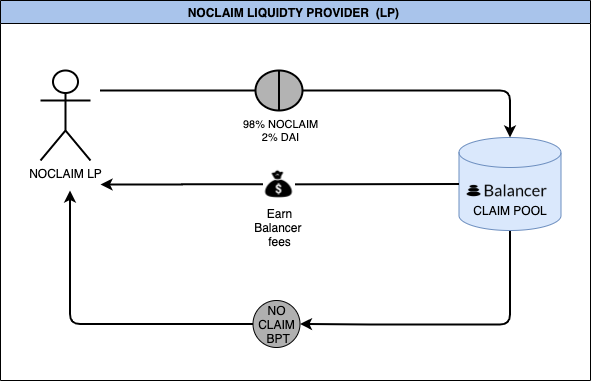

# NOCLAIM Liquidity Provider \(LP\)

“BPool ” button under the [dashboard](https://app.coverprotocol.com/app/dashboard) tab under “My Cover”. This takes you to the correct pool.

1.  Press Add Liquidity.
2. Provide your NOCLAIM token and extra DAI as liquidity \(Balancer also supports single asset deposits\). Note this will be 98% NOCLAIM and 2% DAI.
3. Press Add Liquidity again.
4. Receive NOCLAIM Balancer Pool Token.
5. To remove Liquidity you would press remove liquidity on the same page\*

###                    Flowchart - NOCLAIM Liquidity Provider \(NOCLAIM LP\)

## 

