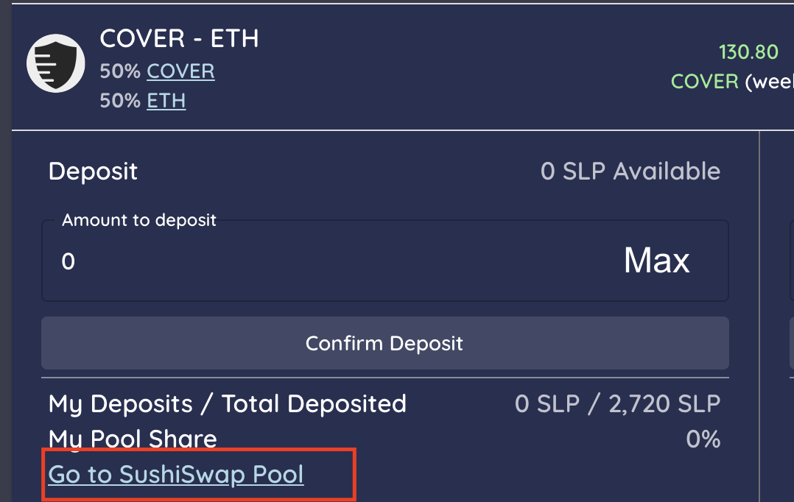
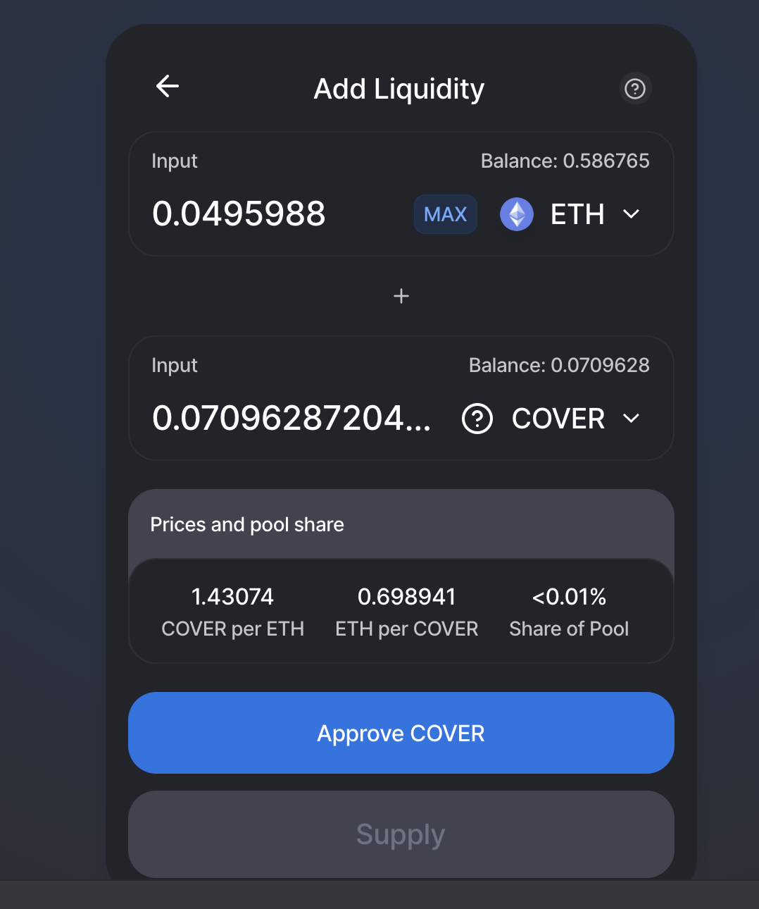

# Pool 2 Liquidity Provider on SushiSwap.fi

Go to the [shield mining](https://app.coverprotocol.com/app/shieldmining) tab.

1. Open the COVER-ETH pool tab and click on the [SushiSwap pool link](https://exchange.sushiswapclassic.org/#/add/0x5d8d9f5b96f4438195be9b99eee6118ed4304286/ETH).
2. This brings you to SushiSwap pools \(external site\).
3. Add 50% COVER and 50% ETH to the SushiSwap [pool](https://exchange.sushiswapclassic.org/#/add/0x5d8d9f5b96f4438195be9b99eee6118ed4304286/ETH).
4. Earn trading fees.
5. Receive a SushiSwap LP \(SLP\) Token which represents 50% COVER & 50% ETH.

