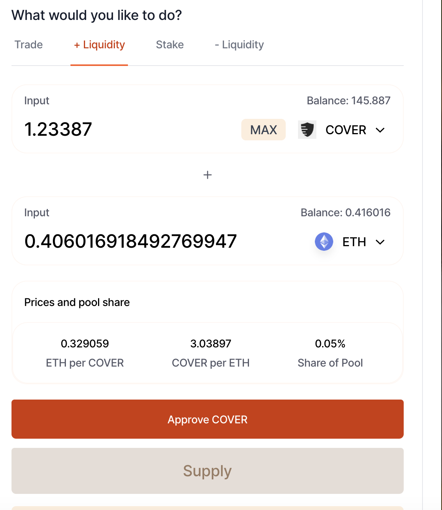

# Liquidity Provider on SushiSwap.fi

1. Go to the [SushiSwap liquidity page](https://sushiswap.fi/pair/0x66ae32178640813f3c32a9929520bfe4fef5d167)
2. Press \(+\) Liquidity 
3. Add 50% COVER and 50% ETH to the [SushiSwap pool](https://sushiswap.fi/pair/0x66ae32178640813f3c32a9929520bfe4fef5d167)
4. Earn trading fees.
5. Receive a SushiSwap LP \(SLP\) Token which represents 50% COVER & 50% ETH

