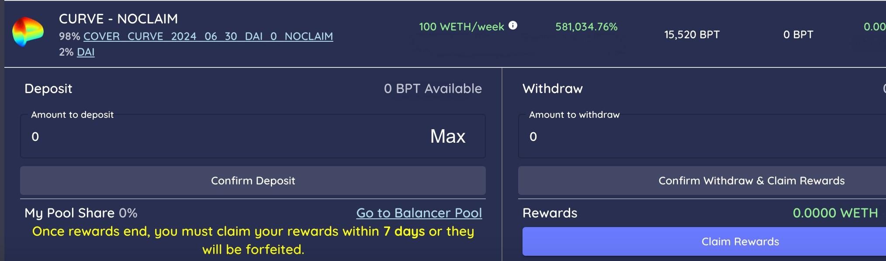

# CovToken Reward Mining

**COMING SOON...**

Go to the [r](https://app.coverprotocol.com/app/shieldmining)ewards tab.

1. Use the CLAIM BPT and/or the NOCLAIM BPT you received from the balancer for providing liquidity.
2. Click the pool that your BPT relates to.
3. Enter the amount you would like to stake. Press “Confirm Deposit” in the COVER Protocol Rewards Portal.

###                   

### Flowchart - Shield Mining \(Coverage Provider & Market Maker\)

**\*BPT = Balancer Pool Token**

## \*\*\*\*

