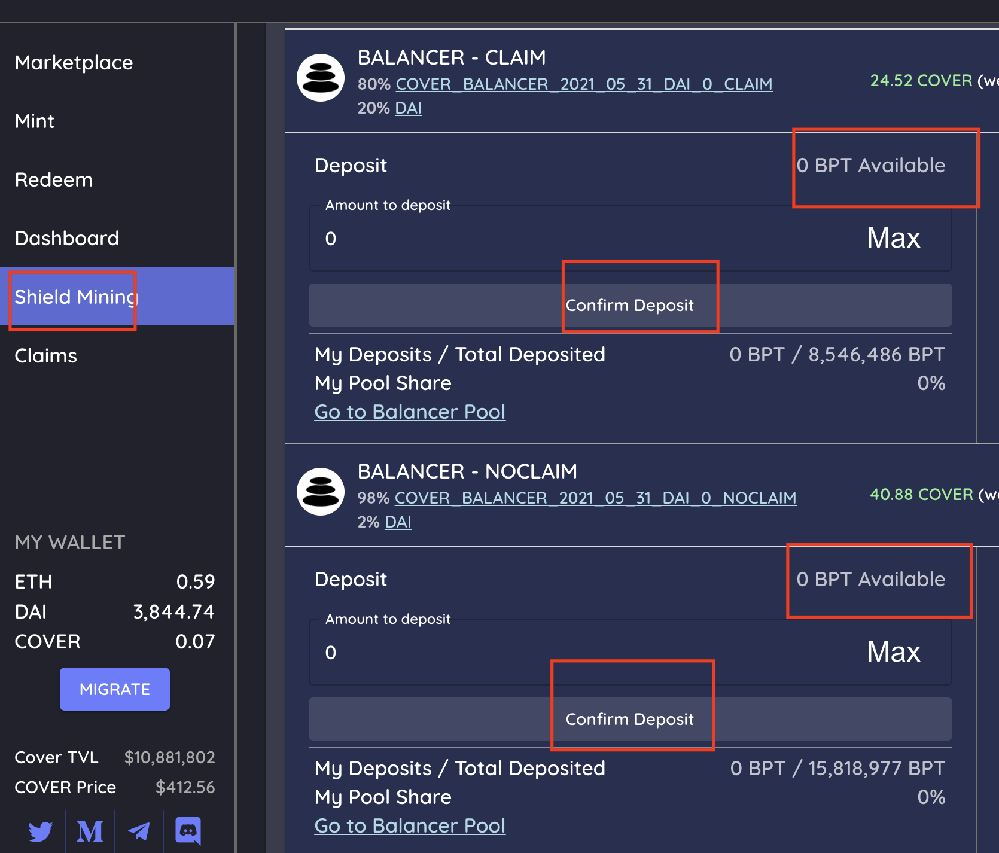
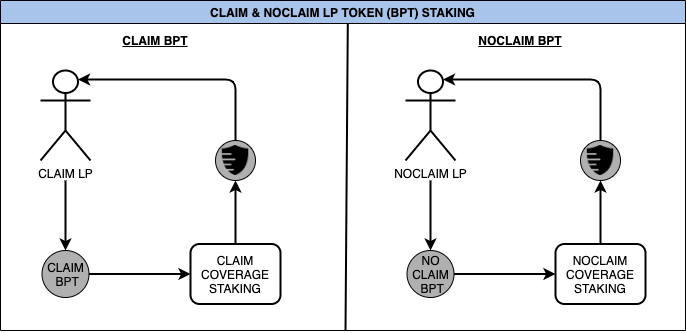

# CovToken Shield Mining To Earn $COVER

Go to the [shield mining](https://app.coverprotocol.com/app/shieldmining) tab.

1. Use the CLAIM BPT and/or the NOCLAIM BPT you received from the balancer for providing liquidity.
2. Click the pool that your BPT relates to.
3. Enter the amount you would like to stake. Press “Confirm Deposit” in the COVER Protocol Staking Portal.
4. You will then earn $COVER tokens.

###                   Flowchart - Shield Mining \(Coverage Provider & Market Maker\)

**\*BPT = Balancer Pool Token**

## \*\*\*\*

