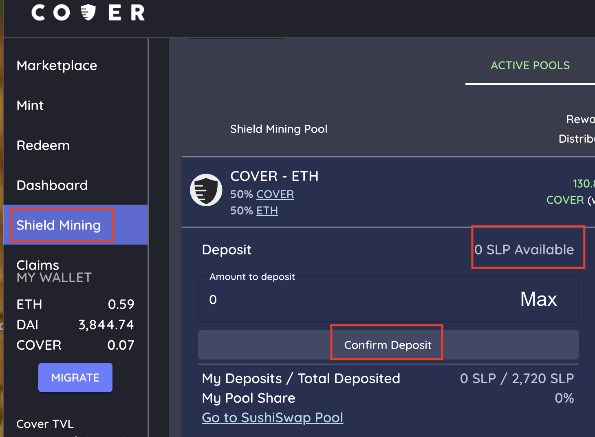

# Pool 2 Liquidity Mining To Earn $COVER

1. Goto the [shield mining](https://app.coverprotocol.com/app/shieldmining) tab.
2. Open the COVER-ETH pool tab.
3. Enter the amount of SushiSwap LP \(SLP\) token you would like to stake. Press “Confirm Deposit” in the COVER Protocol Staking Portal.
4. You will then earn $COVER tokens.

